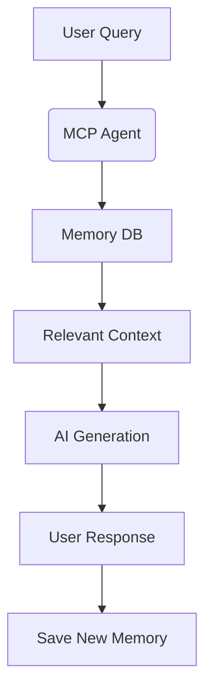

# MemoryPilot: Your AI's Long-Term Memory Engine

(https://raw.githubusercontent.com/Volkov-Labs/MemoryPilot/refs/heads/main/013e761c-7c65-4554-8998-c474ab88c77f.png)[https://raw.githubusercontent.com/Volkov-Labs/MemoryPilot/refs/heads/main/013e761c-7c65-4554-8998-c474ab88c77f.png]
*«Your thoughts are your castle. We're the keykeeper.»*

## 🚀 Product Vision
MemoryPilot is the world's first private, local memory management system for AI assistants. We solve the fundamental problem of AI amnesia by providing contextual recall without cloud dependence or privacy compromises.

## 📦 Core Architecture


## 🌟 Key Features
- Local-first storage (SQLite + vector embeddings)
- Contextual recall (semantic search)
- Memory weighting (adaptive importance system)
- Zero cloud dependency
- Cross-platform (Win/macOS/Linux/RPi)

## 🗺 Product Roadmap

### Phase 1: MVP (Q3 2025)
| Component          | Status     | Release Target |
|--------------------|------------|----------------|
| Core MCP Engine    | In Dev     | Aug 15, 2025   |
| CLI Interface      | Planned    | Sep 1, 2025    |
| Memory Explorer    | Planned    | Sep 15, 2025   |
| Auto-summarization | Research   | Oct 1, 2025    |

### Phase 2: Ecosystem (Q4 2025)
- Obsidian/Notion plugins
- Mobile companion app
- Voice memory capture
- Memory visualization tools

### Phase 3: Pro Features (Q1 2026)
- Emotion-tagged memories
- Cross-device sync (E2EE)
- Memory inheritance system
- Digital legacy planning

## 🎯 Mission Statement
> "To create AI companions that remember what matters - privately, securely, and forever."

## 📊 Success Metrics
| Metric               | Target (Year 1) |
|----------------------|-----------------|
| Active Users         | 10,000          |
| Memory Accuracy      | >92%            |
| Context Recall Speed | <0.8s           |
| Premium Conversion   | 8%              |

## 💻 Technical Foundation

### Core Memory Processing
```python
class MemoryPilot:
    def __init__(self):
        self.db = VectorDB("memory_index")
        self.encoder = SentenceTransformer("all-MiniLM-L6-v2")
        
    def remember(self, query: str) -> dict:
        embedding = self.encoder.encode(query)
        return self.db.query(embedding, top_k=3)
```

## 🔒 Security Principles
1. Zero-knowledge architecture
2. Client-side encryption (AES-256)
3. Memory fragmentation storage
4. Optional memory shredding
5. Regular security audits

## 🌍 Community Pledge
We're building MemoryPilot with four uncompromising principles:

1. Privacy First  
   Your memories never leave your device
   
2. Open Foundation  
   Core engine will be open-source (MIT License)
   
3. Human-Centric Design  
   Memories organized how humans think
   
4. Legacy Preservation  
   Tools for digital immortality

## 🚧 Getting Started (Preview)
```bash
# Clone repository
git clone [https://github.com/Volkov-Labs/gpt-content-manager](https://github.com/Volkov-Labs/gpt-content-manager)

# Install dependencies
pip install -r requirements.txt

# Start memory engine
python -m memorypilot --key=YOUR_PRIVATE_KEY
```
> Note: Full documentation and installation guides coming in v0.1 release (Aug 15, 2025)

---

MemoryPilot © 2025 - The Private Memory Revolution Starts Here  
*Created with 🔥 by visionary product team*
